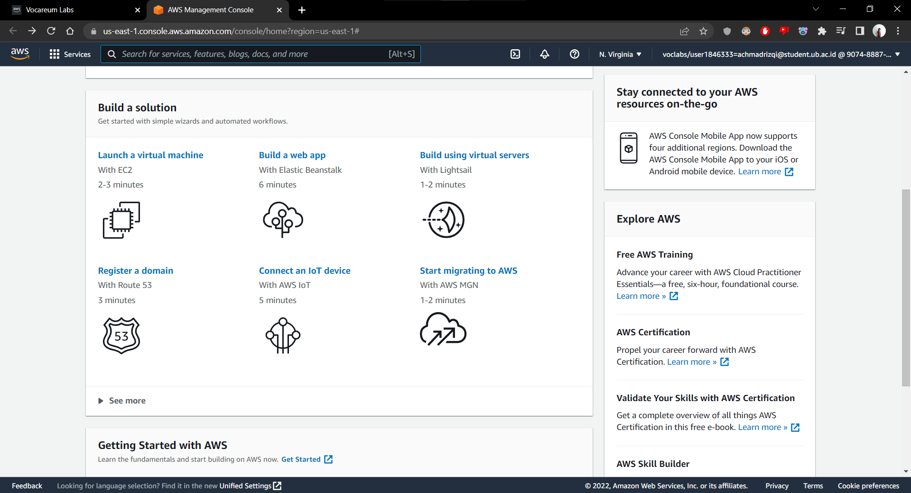
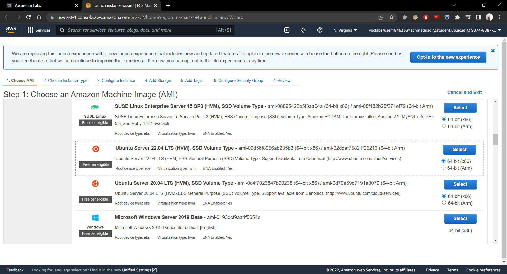
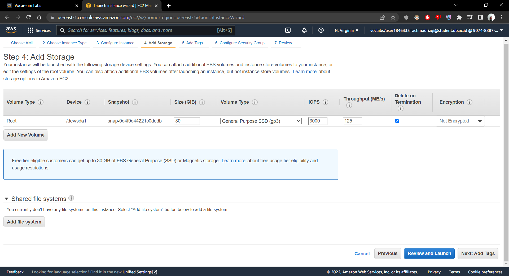
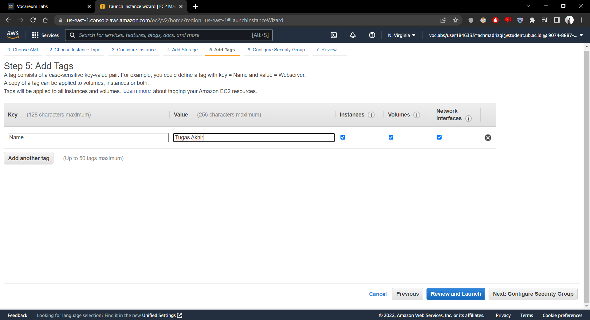
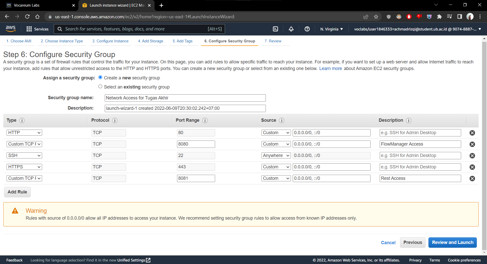
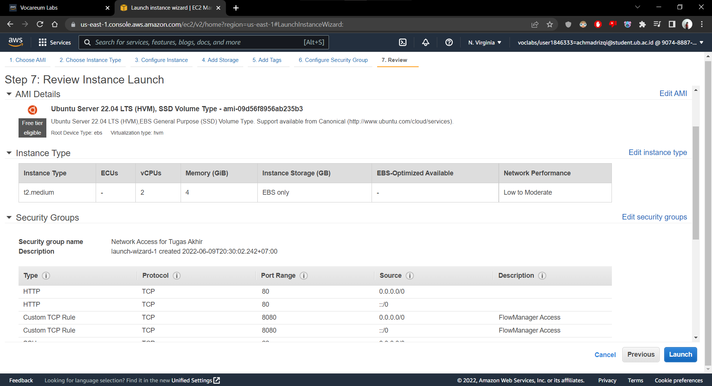
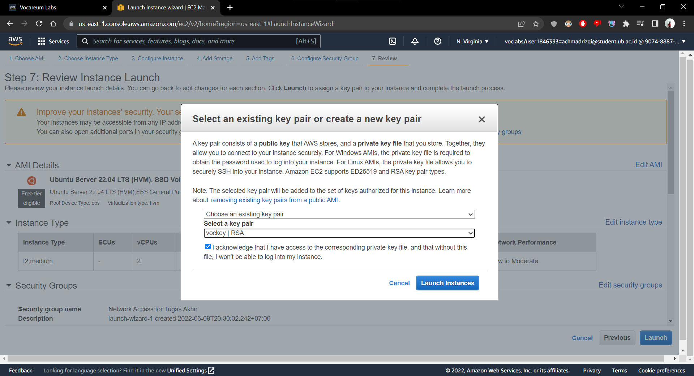
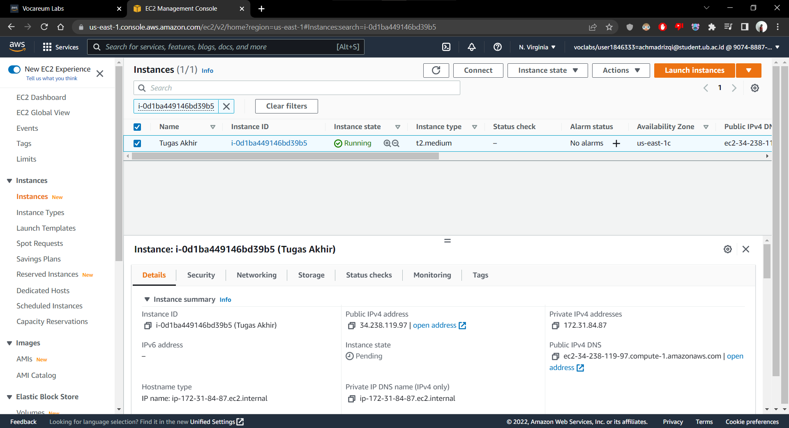
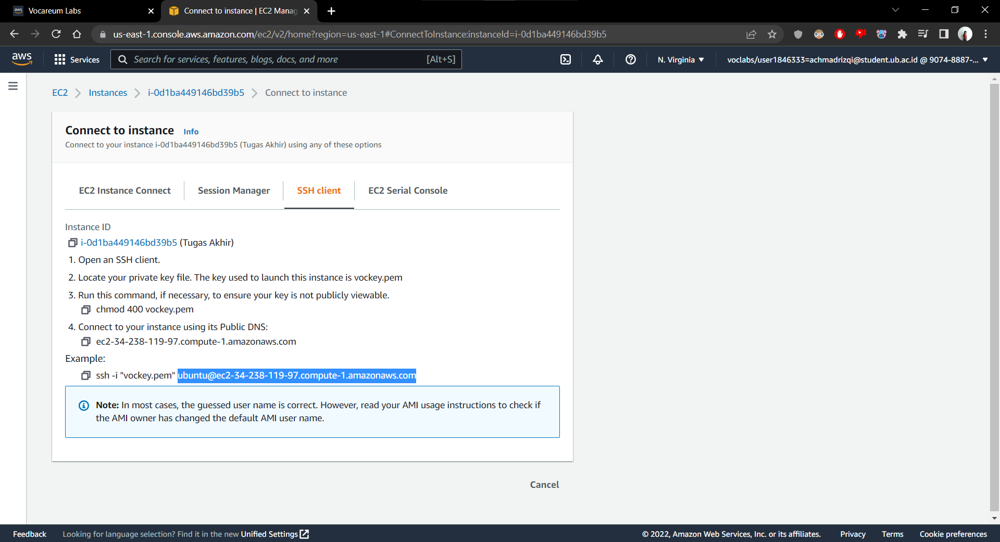
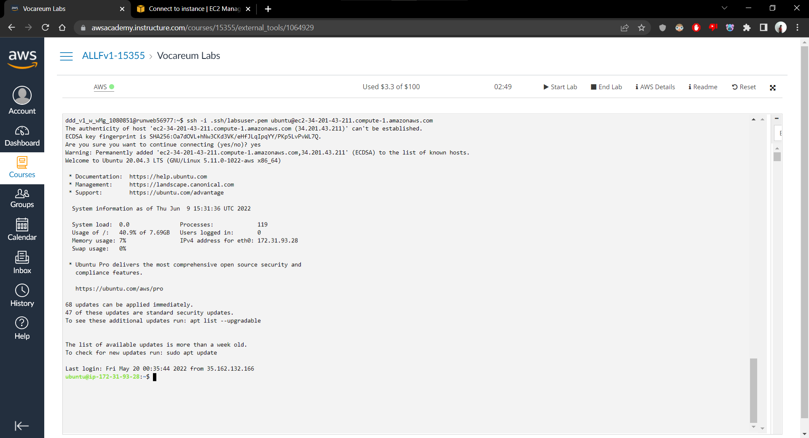

# Part 1: Buat EC2 Instance di AWS Academy

1. Untuk membuat EC2 Instance pada AWS Academy, silahkan membuka Vocareum anda dan jalankan sesi laboratorium virtualnya. Setelah sesi dijalankan, silahkan tekan AWS pada bagian atas console.


2. Kemudian, anda akan diarahkan pada halaman AWS Management Console. Pada bagian **Build a solution**, silahkan pilih **Launch a virtual machine** untuk membuat Virtual Machine menggunakan EC2 Instance.



3. Terdapat tujuh (7) langkah konfigurasi dalam membuat Virtual Machine tersebut. Sesuai dengan soal, konfigurasi yang digunakan pada kesempatan ini adalah:
```
Name and tags:  Tugas Akhir
OS Images: Ubuntu Server 22.04 LTS 64 bit
Instance type: t2.medium
Key pair: vockey
Edit Network settings: allow SSH, allow HTTP, allow HTTPS, allow TCP port 8080, allow TCP port 8081
Configure storage: 30 GiB, gp3
```








4. Setelah mengkaji ulang konfigurasi EC2 Instance yang dibuat, silahkan tekan tombol **Launch**. Anda akan diberikan sebuah *pop up* yang anda akan centang persetujuannya untuk menjalankan *instance* yang telah dibuat.



5. Untuk menjalankan Virtual Machine yang telah dibuat, silahkan tekan instance yang ingin dijalankan dan tekan tombol **Connect** yang terletak sejajar dengan tombol *Launch instances*.



6. Anda akan membuka laman **Connect to instances** pada jendela baru. Silahkan *copy* alamat yang telah di-*highlight* pada gambar dibawah ini. 



7. Silahkan kembali menuju laman *console* **Vocareum Labs** dan silahkan mengetikkan perintah *ssh -i .ssh/labsuser.pem [alamat]*. Dengan *[alamat]* adalah alamat yang telah anda dapatkan pada laman **Connect to instances** sebelumnya. Sebagai contoh: ``ssh -i .ssh/labsuser.pem ubuntu@ec2-34-238-119-97.compute-1.amazonaws.com``


