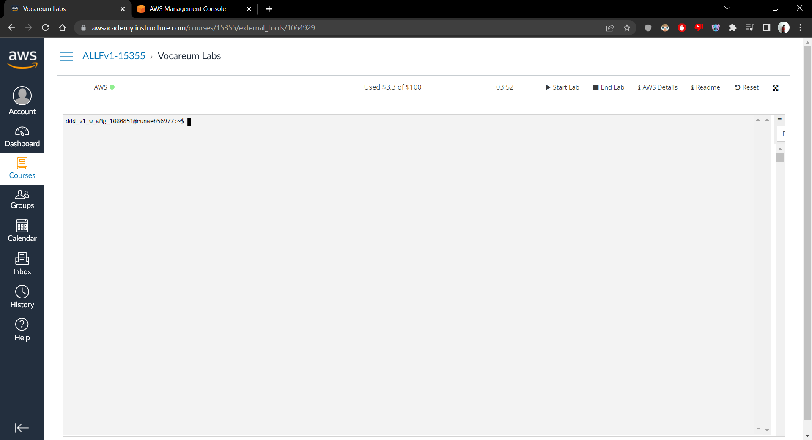

# Part 1: Buat EC2 Instance di AWS Academy

1. Untuk membuat EC2 Instance pada AWS Academy, silahkan membuka Vocareum anda dan jalankan sesi laboratorium virtualnya. Setelah sesi dijalankan, silahkan tekan AWS pada bagian atas console.

2. Kemudian, anda akan diarahkan pada halaman AWS Management Console. Pada bagian **Build a solution**, silahkan pilih **Launch a virtual machine** untuk membuat Virtual Machine menggunakan EC2 Instance.

