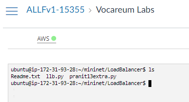
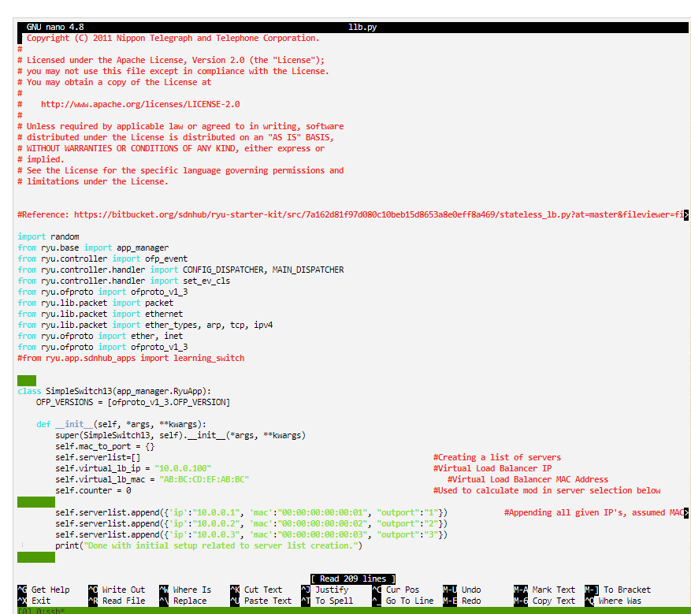
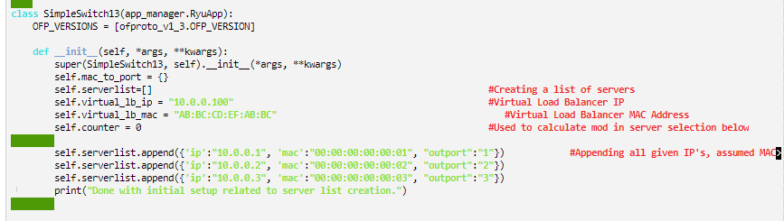
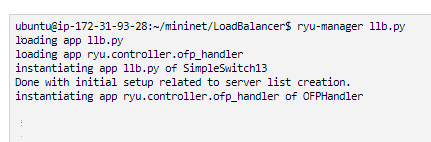
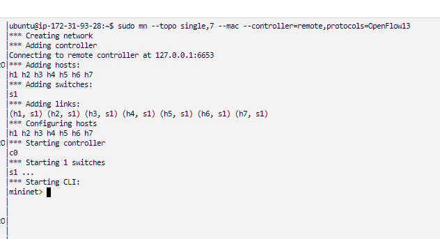
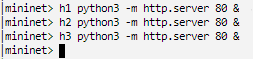
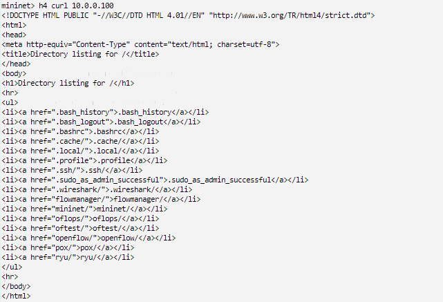
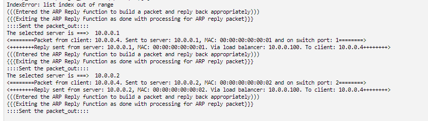
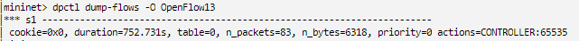
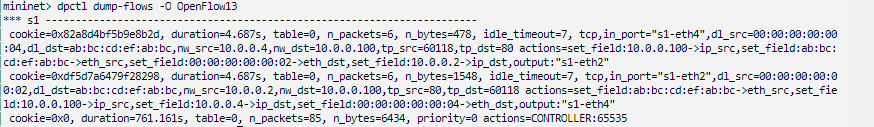

# Part 3: Buat aplikasi Ryu Load Balancer seperti pada [Tugas 3](https://github.com/abazh/learn_sdn/tree/main/LB)

1. Yang dilakukan pertama adalah membuat aplikasi LoadBalancer yang akan digunakan, Pada tugas ini akan digunakan referensi yang telah tersedia dari [Python-Load-Balancer-Application](https://github.com/luqmanhy/Python-Load-Balancer-Application). Setelah kita melakukan git clone, baru dapat kita akses programnya dan kita rubah sesuai yang diinginkan.

2. Pada class SimpleSwitch13, kita dapat merubah berbagai informasi dan property mengenai server yang digunakan. Seperti virtual IP serta MAC address-nya.

3. Setelah dirubah sesuai dengan yang diinginkan, program dapat dijalankan dengan perintah ryu-manager llb.py

4. Kemudian, kita dapat menjalankan mininet dengan topologi gunakan yang standar, semisal dengan perintah: sudo mn --topo single,7 --mac --controller=remote,protocols=OpenFlow13

5. Kemudian, kita dapat menentukan hosts yang menjadi web server dengan perintah [x] python -m SimpleHTTPserver 80 (dengan [x] diisi dengan host yang diinginkan).

6. Sekarang, apabila kita nelakukan perintah curl 10.0.0.100 melalui h4, h5, h6, dan h7. Maka Load Balancer akan berjalan. Tampilan mininet dan ryu-manager llb.py:

7. Hal ini bisa kita amati juga melalui perintah dpctl dump-flows -O OpenFlow13. Berikut adalah tampilan sebelum dan sesudah melakukan perintah h4 curl 10.0.0.100.

