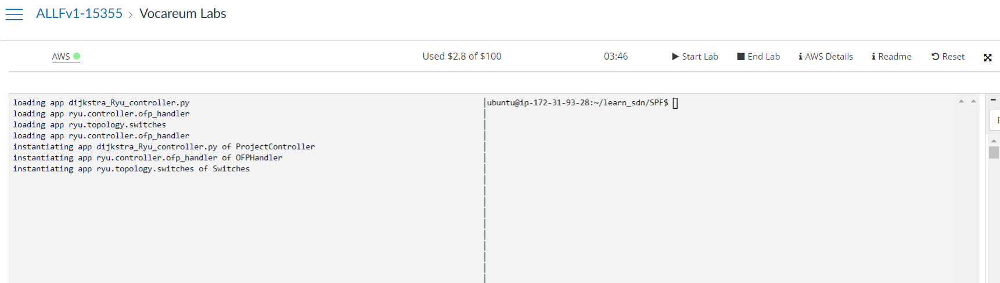
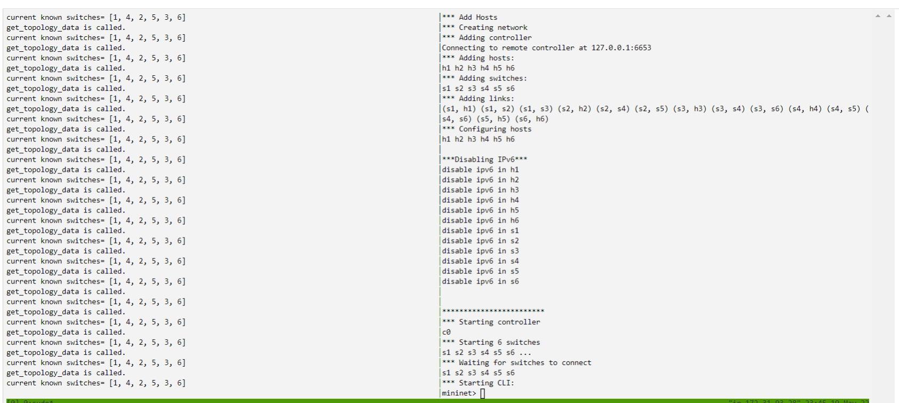
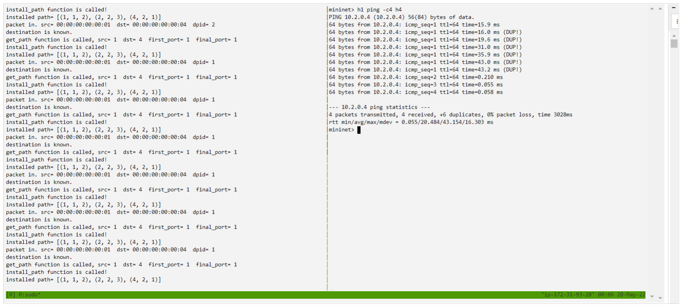
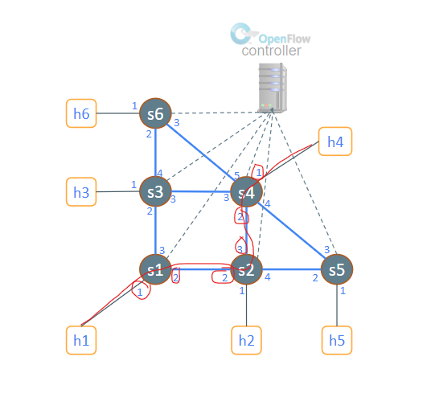
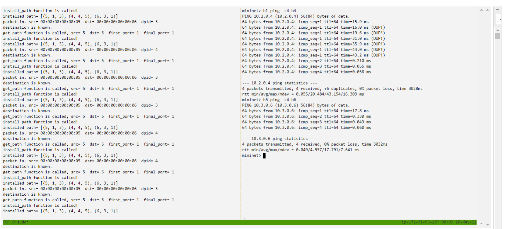
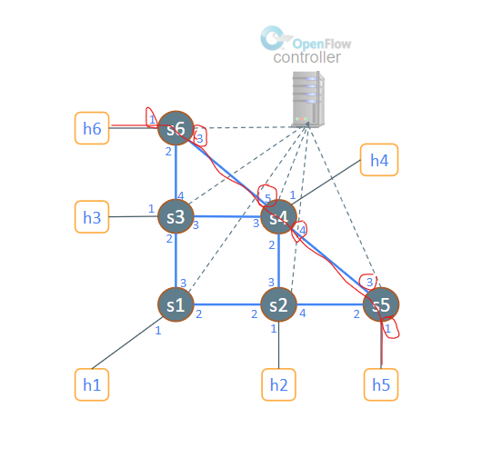
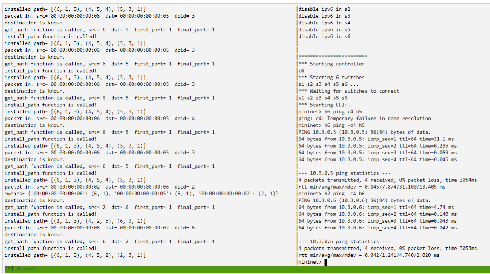
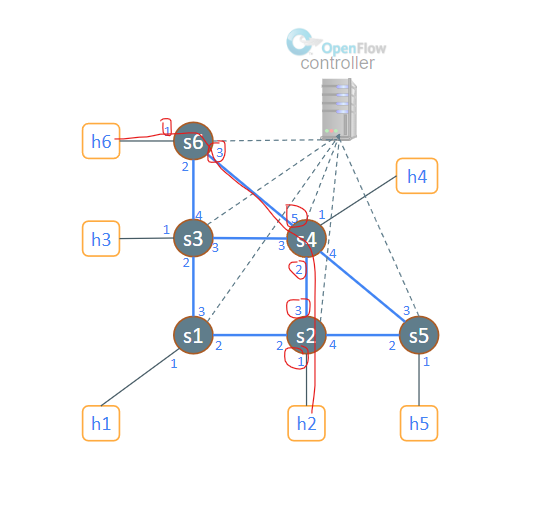

# Part 4: Buat aplikasi Ryu  Shortest Path Routing seperti pada [Tugas 4](https://github.com/abazh/learn_sdn/tree/main/SPF)

1. Yang dilakukan pertama adalah melakukan clone pada repository git yang di sediakan, pada direktori tersebut jalankan perintah ``ryu-manager --observe-links dijkstra_Ryu_controller.py``. Kemudian, pada terminal yang terpisah jalankan sudo python3 topo-spf_lab.py. 

2. Kemudian, jalankan perintah ``h1 ping -c4 h4``. Setelah perintah tersebut berjalan, dapat kita observasi jalan program controller pada terminal kiri. Pada line terakhir, dapat kita simpulkan bahwa rute yang didapatkan oleh algortima yang digunakan adalah melalui (s1, 1 --> 2), (s2, 2 --> 3), (s4, 2 --> 1).

3. Kemudian, jalankan perintah ``h5 ping -c4 h6``. Setelah perintah tersebut berjalan, dapat kita observasi jalan program controller pada terminal kiri. Pada line terakhir, dapat kita simpulkan bahwa rute yang didapatkan oleh algortima yang digunakan adalah melalui (s6, 1 --> 3), (s4, 5 --> 4), (s5, 3 --> 1).

4. Kemudian, jalankan perintah ``h5 ping -c4 h6``. Setelah perintah tersebut berjalan, dapat kita observasi jalan program controller pada terminal kiri. Pada line terakhir, dapat kita simpulkan bahwa rute yang didapatkan oleh algortima yang digunakan adalah melalui (s2, 1 --> 3), (s4, 2 --> 5), (s6, 3 --> 1).

