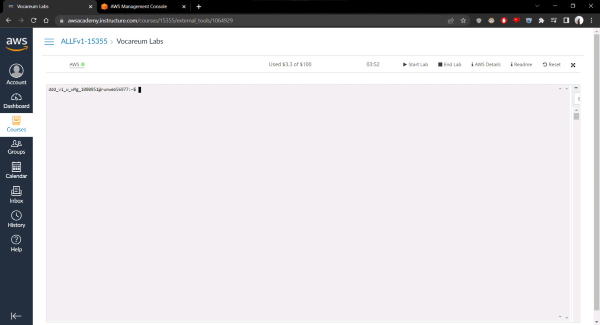

# SDN_Ryu_Tugas_Akhir

Repositori ini dibuat untuk memenuhi Tugas Akhir mata kuliah Arsitektur Jaringan Terkini Prodi Teknik Komputer Fakultas Ilmu Komputer Universitas Brawijaya.

## Deskripsi Tugas Akhir: 
Mengerjakan ulang semua tugas yang dikerjakan dari Tugas 1 sampai dengan Tugas 4 dalam satu dokumentasi utuh dan dipublikasikan melalui akun personal anda di github.com. Dokumentasi yang dimaksud ditulis dalam README.md dgn format Markdown
Artinya dalam tugas tersebut terdiri 4 bagian utama dengan rincian sebagai berikut:

### 1. Buat EC2 Instance di AWS Academy:

- Name and tags: Tugas Akhir
- OS Images: Ubuntu Server 22.04 LTS 64 bit
- Instance type: t2.medium
- Key pair: vockey
- Edit Network settings: allow SSH, allow HTTP, allow HTTPS, allow TCP port 8080, allow TCP port 8081
- Configure storage: 30 GiB, gp3.``
- Setelah EC2 Instance siap, lakukan instalasi Mininet+OpenFlow, Ryu dll sesuai rujukan di [sini](https://awsacademy.instructure.com/courses/15355/discussion_topics/32566).

### 2. Buat Custom Topology Mininet seperti pada [Tugas 2](https://drive.google.com/file/d/1P5X1yZ7M3bwaLmV8N0KNivZilSDYwJvJ/view).
- 2 program mininet yang mendeskripsikan topology mininet 2 host dan 2 switch dan topology mininet 3 switch (loop) dengan 6 host
- Melakukan percobaan pada topology mininet 3 switch (loop) dengan 6 host dengan penerapan STP (spanning tree protocol) dengan secara manual menulis flow pada masing-masing switch
### 3. Buat aplikasi Ryu Load Balancer seperti pada [Tugas 3](https://github.com/abazh/learn_sdn/tree/main/LB)
- Melakukan percobaan aplikasi load balancer.
### 4. Buat aplikasi Ryu  Shortest Path Routing seperti pada [Tugas 4](https://github.com/abazh/learn_sdn/tree/main/SPF)
- Melakukan percobaan aplikasi SPF.

## Sneakpeek

